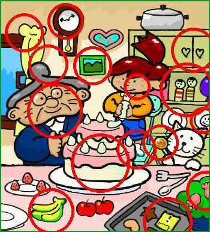
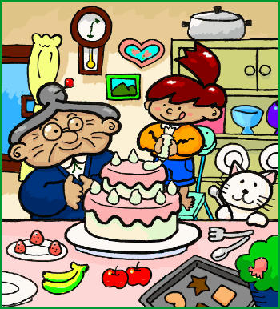
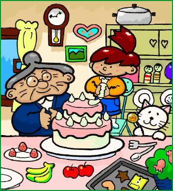

# Spot Image Difference

`Spot Image Difference` is a casual project that aims to play [Spot the Difference](https://en.wikipedia.org/wiki/Spot_the_difference) puzzle game automatically.

## Run

```
cargo run   <output path>

e.g.
cargo run ./input1.jpg ./input2.jpg ./output.jpg
```

## Example

<p align="center">
  
</p>

<p align="center">
  
  
</p>

## Article

[The magic portal](https://medium.com/@pailee.wai/solving-spot-the-difference-puzzle-d26a884de12d)
